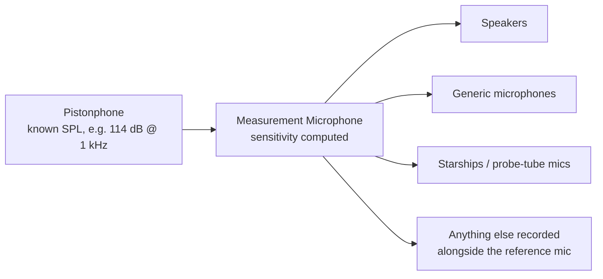

# Calibration Concepts

## The problem

Microphones and speakers do not perfectly match factory specifications. A microphone converts sound pressure (Pascals) into a voltage. A speaker does the reverse: voltage in, sound pressure out. Neither conversion is perfectly predictable from first principles. Two microphones of the identical make and model, sitting side by side, will produce slightly different voltages for the exact same sound. The same microphone will also drift over time, with temperature, humidity, and age.

So if you want to measure accurate levels, your signal chain has to be measured against a known, trusted physical reference.

A microphone's electrical output is **voltage**, not sound pressure. We need to know how many volts (or millivolts) that specific microphone produces per Pascal of sound pressure. This ratio is its sensitivity (usually expressed in mV/Pa or dB re 1 V/Pa). Once you know a microphone's sensitivity, converting its raw recording into Pascals, and from there into dB SPL, is simple arithmetic.

So how do you find a microphone's sensitivity in the first place? You need something that produces a known sound pressure level. That's a pistonphone, a small device that generates a very precise, stable sound pressure at a known frequency and level. Record a microphone's voltage output while a pistonphone is running, and you can compute its sensitivity directly: you know the SPL (from the pistonphone's rating) and you measure the voltage (from the recording). This is exactly what the [Measurement Microphone Calibration](plugins/measurement-microphone.md) workspace in cftscal does.

## Which way round is "sensitivity"?

Sensitivity is a ratio, and it can be written either way up. cftscal and these docs follow the convention used in the technical literature and on most datasheets:

- **A microphone's** sensitivity is the voltage it generates per Pascal of sound pressure — volts per Pascal, V/Pa.
- **A speaker's** sensitivity is the reverse: the sound pressure it produces for a given drive voltage (or, equivalently, the voltage you need to supply per Pascal of output).

!!! warning "The legacy EPL convention is the other way up"
    The EPL cochlear function test suite expresses sensitivity as Pa/V rather than V/Pa. If you're comparing numbers against EPL's, or reading older lab notes, one is the reciprocal of the other — or, in dB, the negative. [Reading cftscal's reported numbers](reference/calibration-math.md#reading-cftscals-reported-numbers) lists exactly what's in each field of the GUI.

## One number, or a curve?

A *measurement* microphone is assumed to have the same sensitivity at every frequency, so a single number describes it completely. That assumption holds if you spend enough money on the microphone — a precision microphone really is flat across its rated range.

It doesn't hold for a cheap one. Sometimes a precision microphone is overkill and you just want to record audio during an experiment; an inexpensive microphone's sensitivity will vary substantially with frequency, so it has to be described by a curve instead of a single number. That's the difference between cftscal's two microphone workspaces: [Measurement Microphone Calibration](plugins/measurement-microphone.md) produces one flat value, and [Generic Microphone Calibration](plugins/generic-microphone.md) produces sensitivity as a function of frequency.

## The calibration chain

Once a microphone has a known sensitivity, you can use it to calibrate everything else.

This is why the measurement microphone calibration is usually the first thing you do in a session. Everything downstream inherits its accuracy (or its error) from this one step.

Every downstream calibration works the same way: play a known stimulus, record it with the reference microphone *and* with the device under test **at the same time**, and compare. Because the reference microphone tells you what the sound pressure actually was, anything the other recording does differently must be a property of the device under test. That's also why the two microphones have to be genuinely co-located for a [generic microphone calibration](plugins/generic-microphone.md) — a difference in distance or angle from the speaker gets attributed to the microphone, since the arithmetic has no way to tell the two apart.

The equations behind each link in this chain are written out in [Calibration Math](reference/calibration-math.md).

## Calibrating in the ear is a special case

Inserting a probe into an ear *changes the acoustics of the system*. The ear canal presents a different acoustic load — largely a compliance, set by the enclosed volume — which shifts the resonances of the system, so the transfer function you measured in a coupler on the bench is no longer the transfer function you have in the ear.

The practical consequence: **an in-ear calibration has to be redone every time the microphone is repositioned while it's in the ear.** It isn't a one-time measurement you can carry across a session. This is what the [Starship Check](plugins/starship-check.md) workspace is for — verifying that an already-calibrated starship is behaving as expected in the ear it's actually sitting in right now.

Small acoustic cavities also have resonances squarely inside the frequency range CFTS measures — a 20 mm probe tube resonates at about 4 kHz, with further modes above that (see [Acoustic tube resonance](reference/hardware-design.md#acoustic-tube-resonance)). A calibration measures and compensates for those resonances correctly, but only as long as the geometry doesn't change afterwards. A probe that shifts, a tube that clogs, or a coupler that doesn't match how the device is really used all move the resonances and invalidate the compensation.

## Why redo it? Isn't a microphone's sensitivity fixed?

Approximately, but not exactly, and "approximately" isn't good enough for a measurement instrument. Sensitivity drifts with age, temperature, humidity, and physical handling. Re-running the pistonphone calibration regularly (many labs do it every session, or at minimum on a fixed schedule) is cheap insurance against silently drifting numbers. cftscal keeps every past calibration on disk with a timestamp specifically so you can see when a device was last checked and how much (if at all) its sensitivity has moved.
