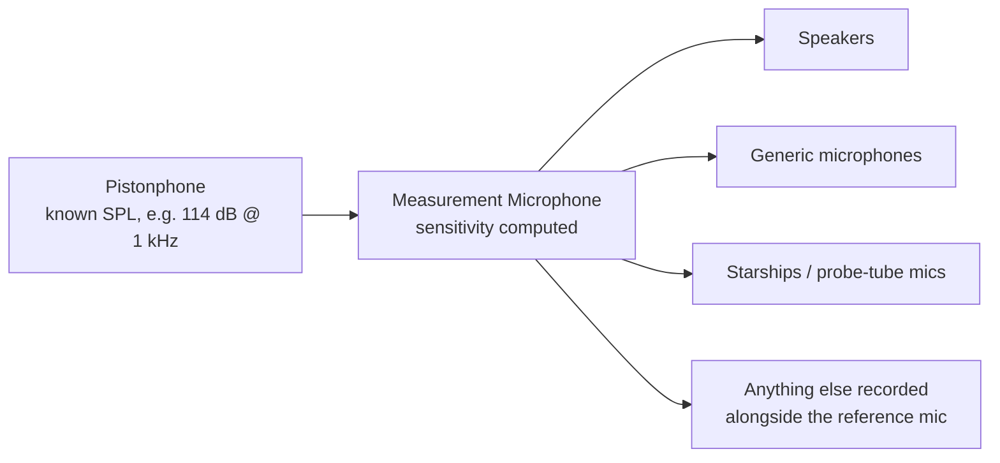

# Calibration Concepts

## The problem

Microphones and speakers do not perfectly match factory specifications. A microphone converts sound pressure (Pascals) into a voltage. A speaker does the reverse: voltage in, sound pressure out. Neither conversion is perfectly predictable from first principles. Two microphones of the identical make and model, sitting side by side, will produce slightly different voltages for the exact same sound. The same microphone will also drift over time, with temperature, humidity, and age.

So if you want to measure accurate levels, your signal chain has to be measured against a known, trusted physical reference.

A microphone's electrical output is **voltage**, not sound pressure. We need to know how many volts (or millivolts) that specific microphone produces per Pascal of sound pressure. This ratio is its sensitivity (usually expressed in mV/Pa or dB re 1 V/Pa). Once you know a microphone's sensitivity, converting its raw recording into Pascals, and from there into dB SPL, is simple arithmetic.

So how do you find a microphone's sensitivity in the first place? You need something that produces a known sound pressure level. That's a pistonphone, a small device that generates a very precise, stable sound pressure at a known frequency and level. Record a microphone's voltage output while a pistonphone is running, and you can compute its sensitivity directly: you know the SPL (from the pistonphone's rating) and you measure the voltage (from the recording). This is exactly what the [Measurement Microphone Calibration](plugins/measurement-microphone.md) workspace in cftscal does.

## The calibration chain

Once a microphone has a known sensitivity, you can use it to calibrate everything else.

This is why the measurement microphone calibration is usually the first thing you do in a session. Everything downstream inherits its accuracy (or its error) from this one step.

## Why redo it? Isn't a microphone's sensitivity fixed?

Approximately, but not exactly, and "approximately" isn't good enough for a measurement instrument. Sensitivity drifts with age, temperature, humidity, and physical handling. Re-running the pistonphone calibration regularly (many labs do it every session, or at minimum on a fixed schedule) is cheap insurance against silently drifting numbers. cftscal keeps every past calibration on disk with a timestamp specifically so you can see when a device was last checked and how much (if at all) its sensitivity has moved.
