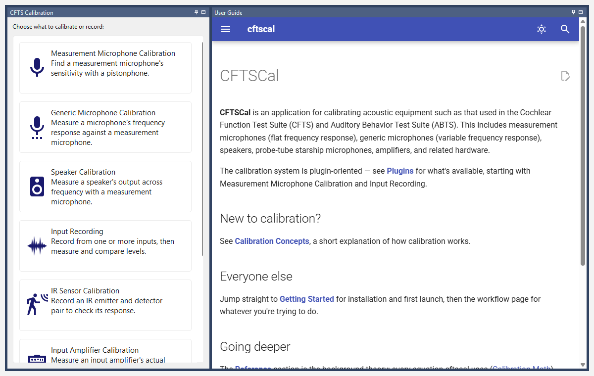
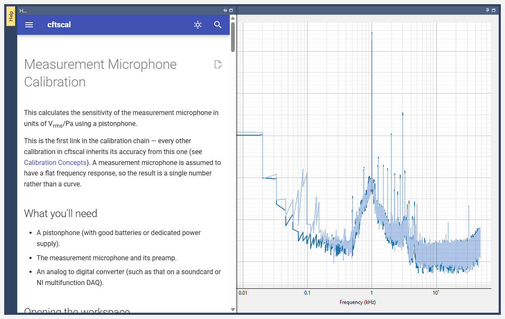

# Getting Started

## Installation

cftscal is a standard Python package, installable via pip:

    python -m pip install cftscal

This registers a `cfts-cal` command in your environment. — see [Calibration Concepts](concepts.md) for why cftscal itself has no hardware I/O of its own).

## Launching cftscal

In a console:
```bash
cfts-cal
```

cftscal opens on **Home**: a tile for each calibration workspace available on this computer, and this user guide beside them.



Click a tile to open that workspace; *Workspace > Home* brings you back. To skip Home and go straight to a workspace, name it when you launch cftscal, e.g. `cfts-cal microphone-measurement`.

By default, a workspace only shows up — on Home and in the *Workspace* menu — if cftscal detects the matching hardware channel. If a workspace you expect doesn't show up, see [Workspace Settings](#workspace-settings) below — both for how hardware detection is configured, and for how to load a workspace anyway without its hardware present.

## Help inside cftscal

This guide is built into cftscal, so it's there even on a computer with no network connection:

- On **Home**, the *User Guide* panel shows it, starting at this guide's home page.
- In **every workspace**, the narrow *Help* tab on the left edge slides out that workspace's own page of the guide. Click it to open it; click back in the workspace to put it away.



Links between pages work as they do here, the search box at the top of each page searches the whole guide, and right-clicking a page gives *Back*, *Forward* and *Reload*.

## Workspace Settings

Before calibrating anything, cftscal needs to know:

- **Data folder** — where calibration results get saved. Defaults to `~/Documents/cftscal`, but you can point it anywhere (e.g. a shared lab drive).
- **Hardware** — which acquisition backend to use (a dedicated sound card, an NI-DAQ system, etc.). This determines which input/output channels are available to every other plugin.
- **Audio device & sample rate** *(sound card hardware only)* — the specific device and sampling rate to record/play at. Pick a sample rate your hardware and microphones actually support; if you're not sure, the dropdown only lists rates cftscal has confirmed the selected device supports.
- **Always load these plugins** — force specific workspace tabs to show up in view-only mode, even without their hardware detected. Useful for reviewing or exporting existing calibrations on a computer that doesn't have the relevant hardware (e.g. a laptop with no sound card). Takes effect immediately on Save, no restart needed.

## The general pattern

Every calibration workspace in cftscal (microphone, speaker, starship, input recording, ...) follows the same basic layout:

- A **Help** tab on the left edge, which slides out this guide's page for the workspace (see [Help inside cftscal](#help-inside-cftscal)).
- A **Settings** panel (usually top-left) — pick an input/output channel, a target folder, a sensor/device label, and any other parameters, then click a button to run the calibration or recording.
- A **plot** area showing the result of the currently selected calibration from the list below.
- A **list/tree** of everything previously recorded for this workspace, organized into folders (by default, one per device — see [Calibration Concepts](concepts.md) for why you might reorganize this). Tick an entry to plot it. **Right-click an entry** for actions like adding a note, exporting or deleting it; double-click to rename it, or drag it onto a folder to move it. A sticky-note icon after a name means it has a note (hover to read it); a warning icon means it couldn't be read properly (hover for why).

Every workspace's **Target folder** works the same way: pick an existing folder, or leave it at *(auto create from …)* to have a folder made for you, named after the field shown in brackets (e.g. *sensor ID* for a microphone).

Actually running a calibration launches a separate window (`psi`, the underlying acquisition engine). cftscal ships a sensible starting dock-panel layout and preference set for most calibration types, so this window is usually already arranged reasonably the first time you see it. If you want to change it, rearrange the panels and use that window's own *Configuration > Layout > Set default* menu (and similarly for *Configuration > Preferences*) — your own saved arrangement always takes precedence from then on and is never overwritten by cftscal.

Once you're oriented, move on to the [Plugins](plugins/index.md):

- [Measurement Microphone Calibration](plugins/measurement-microphone.md) — usually the first thing you do in a session.
- [Input Recording](plugins/input-recording.md) — for recording and reviewing any signal from one or more channels at once, with flexible filtering and calibrated WAV export.
- [Speaker Calibration](plugins/speaker.md) and [Generic Microphone Calibration](plugins/generic-microphone.md) — calibrate a speaker or a non-precision microphone against your measurement microphone.
- [Starship Calibration](plugins/starship.md) and [Starship Check](plugins/starship-check.md) — calibrate a starship, then periodically verify it's still behaving once it's in use.
- [Input Amplifier Calibration](plugins/input-amplifier.md) — verify a standalone signal preamp's actual gain.
- [IR Sensor Calibration](plugins/ir-sensor.md) — a diagnostic recording tool for IR emitter/detector pairs.

If you'd rather know what's happening underneath, the [Reference](reference/index.md) section has the equations ([Calibration Math](reference/calibration-math.md)), the spectrum-estimation details ([Signal Analysis](reference/signal-analysis.md)), and the rig-design arithmetic ([Hardware Design](reference/hardware-design.md)).
