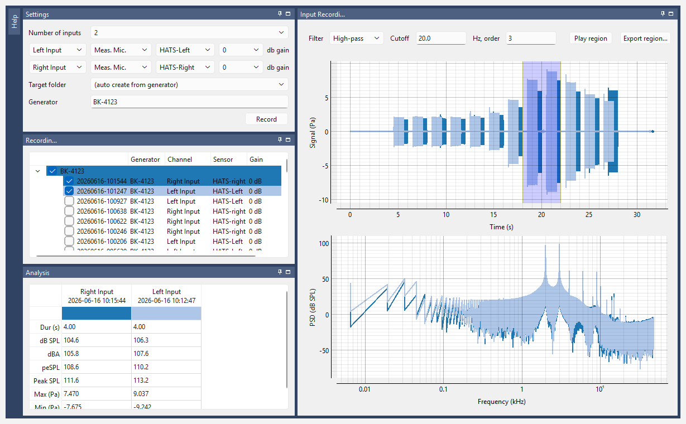

# Input Recording

Input Recording isn't tied to a specific calibration procedure. It's a general-purpose tool for capturing and reviewing whatever's coming into one or more input channels simultaneously.

## Recording

Run CFTSCal and select the **Input Recording** workspace.

*Two recordings plotted, one from each ear's microphone. The shaded band on the waveform is the selected region; the Analysis table and the spectrum below it are computed from that part of each recording only (see [Selecting a region](#selecting-a-region)).*

| Field | What it means |
| --- | --- |
| **Number of inputs** | How many channels to record at once, from 1 up to the total number your hardware exposes. One row appears below for each. |
| **Input** *(first dropdown on each row)* | Which physical input this row records. The dropdown doubles as the row's label, so there's no separate "Input 0"/"Input 1" text. Pick any channel here; the same physical channel can't be assigned to two rows at once. |
| **Sensor type and calibration** *(next one or two dropdowns)* | What kind of sensor is attached (see [Sensor types](#sensor-types) below), plus — for most types — a second dropdown picking which specific calibration to use. |
| **dB gain** *(last dropdown on each row)* | The preamp gain, in dB, currently applied to that row's channel. It must match the amplifier's actual setting. |
| **Target folder** | Which folder the recording is saved in. Shared across all rows, since they're saved together as a single recording. Leave it at *(auto create from generator)* to have a folder made for you, named after the **Generator** text (lowercased, with spaces and punctuation turned into hyphens). |
| **Generator** | Free text describing what produced the sound — e.g. *pistonphone*, *speaker 3*. It's saved with the recording exactly as you type it, but isn't remembered between sessions. |

### Sensor types

| Type | What it means |
| --- | --- |
| **Meas. Mic.**, **Generic Mic.**, **Input Amp.**, **Starship** | Loads a real, on-file calibration — pick the specific one from the second dropdown. This calibration converts the recorded voltage to Pascals. |
| **Unity** | A pass-through: records the raw voltage without converting it to Pascals. Since there's nothing to pick, the second dropdown is hidden. |
| **Nominal** | For a device with no measured calibration on file — e.g. going off a spec sheet value. Replaces the second dropdown with an **mV/Pa** field where you type the sensitivity directly; the recording is calibrated to Pascals using that value. Note the direction of the ratio: millivolts *generated per Pascal*, the convention used on most datasheets. If your datasheet gives Pa/V instead, take the reciprocal — see [Which way round is "sensitivity"?](../concepts.md#which-way-round-is-sensitivity) |

## Running the recording

To run the recording, click the *Record* button — this captures every active channel simultaneously, saved together as one recording. The button stays disabled until:

- every row has a sensor selected,
- no two rows point at the same physical input, and
- the **Generator** contains at least one letter or digit.

If that state is somehow reached anyway, clicking *Record* shows a warning explaining why rather than failing silently.

## Reviewing the results

Select one or more recordings in the *Recordings* list to plot them. The *Input Recording* plot shows the calibrated time-domain waveform; the region you select drives both the PSD plot and the *Analysis* table below. If a recording is longer than 90 seconds, the plot opens on its first 90 seconds; drag the plot to move along it, or zoom out (scroll, or right-click > *View All*) to see all of it.

**Recordings** (the list) shows every recording ever made for this workspace, with the following columns:

| Column | Meaning |
| --- | --- |
| Name | Which folder the recording is filed under (with *auto create*, named after the generator). |
| Date | When the recording was made. |
| Generator | Which stimulus/generator label was used. |
| Channel | Which input channel(s) were recorded — comma-separated if more than one. |
| Sensor | Which sensor was attached to each channel — comma-separated in the same order as Channel. |
| Gain | The preamp gain, in dB, that was in effect for each channel — comma-separated in the same order as Channel. |

A warning icon after a recording's name means it couldn't be read properly (hover for why); a sticky-note icon means it has a note. To add or change a note, right-click the recording and choose *Edit note…* — the note is saved inside the recording's folder, and hovering over the row shows it.

Each recording gets its own color, matching its highlight in the *Recordings* list. If a recording has more than one channel, all of its channels share that color but are distinguished from each other by line style (solid, dash, dot). The *Analysis* table has a column for each recorded channel, headed by the channel and the date and time of its recording, so channels you're comparing (say, the left and right ears) sit side by side. The strip of color at the top of each column matches that recording's color, and a recording's channels appear as neighboring columns. Each row is one measurement of whatever's inside the currently selected region:

| Row | What it shows |
| --- | --- |
| **Dur (s)** | Length of the selected region. |
| **dB SPL** | RMS level, after the *Filter*. |
| **dBA** | A-weighted RMS level. Always measured from the unfiltered recording, whatever the *Filter* is set to, so it's there without switching the filter to dBA. It's A-weighted exactly as the dBA *Filter* would be, following the *Zero-phase* and *Exact A-weighting* checkboxes. |
| **peSPL** | Peak-equivalent SPL: the RMS level of a sine wave with the same peak-to-peak amplitude. For a pure tone it equals dB SPL; for clicks and other brief sounds it's the usual way to state their level. |
| **Peak SPL** | Half the peak-to-peak amplitude, in dB SPL — 3 dB above peSPL. (This was called "pe SPL" before peSPL was added.) |
| **Max (Pa)**, **Min (Pa)** | The most positive and most negative pressure. A lopsided pair shows the waveform isn't symmetric, which the peak-to-peak rows can't. |

Every row except dBA is measured after the *Filter*. A dash means the selected region doesn't overlap that recording.

### Selecting a region

- *Ctrl+drag* anywhere on the time plot to draw a new region from scratch — including inside the current region, so you can select a smaller part of it.
- *Drag an edge* of the existing region to resize it.
- *Drag the middle* of the region to move it without resizing.
- A plain drag (no Ctrl) pans the plot as usual.

Only the samples inside the selected region are used for the Analysis table and PSD.

### Choosing a filter

The *Filter* dropdown controls the filtering that gets applied to the signal before it's plotted and the level is computed. It only changes what's shown and measured; the saved recording is never altered.

| Mode | What it does |
| --- | --- | 
| **High-pass** *(default)* | Removes everything below a *Cutoff* frequency (20 Hz unless you change it). With the default *order* of 3 it matches the HP filter on a GRAS 12AQ power module: a 3-pole Butterworth, 3 dB down at the cutoff and falling 18 dB per octave below it. Use it to keep building rumble and handling noise out of the level. A higher order cuts off more steeply. Like the 12AQ's own filter, it shifts the phase of low frequencies slightly, unless *Zero-phase* is ticked. |
| **Unfiltered** | No filtering at all — deliberately not labeled "dBZ", since that would imply a standardized flat response over a defined range, and this is simply whatever bandwidth the raw recording happens to have. |
| **dBA** | Standard A-weighting (IEC 61672-1). See *Exact A-weighting* below. |
| **Band-pass** | Keeps only a band of frequencies: centered on *Center freq.*, *width* octaves wide (1/3 octave unless you change it), with an adjustable *order* (higher orders roll off more sharply outside the band). The band edges are 3 dB down. A center of 1000 Hz and a width of 4 octaves (250 Hz to 4 kHz) has the same band edges as the filter in the lab's older MATLAB tool, measure_sound, but not the same shape. | 

Two checkboxes at the end of the *Filter* row change how the filter is applied. Neither changes the filter's shape (its cutoffs, slopes or band edges), so neither changes the dB SPL or dBA of a steady sound:

- **Zero-phase** *(off by default)*. Off, each filter acts the way an analog filter would, like the 12AQ's high-pass or a sound level meter's A-weighting: frequencies near the cutoff come out slightly delayed, which reshapes clicks and other brief sounds, so their peSPL, Peak SPL and Max/Min can differ from the unfiltered recording. Ticked, the same filter is applied without any delay, so the filtered waveform lines up exactly with the original. The catch is that a zero-phase filter responds a little *before* a sudden sound starts, which can look like an artifact just ahead of a click. Leave it off to match what analog equipment would read. Tick it to compare waveform shapes or timing.
- **Exact A-weighting** *(off by default)*. Off, A-weighting uses a standard digital approximation of the curve. It's exact at low and middle frequencies but falls short of the standard near the top of the recording's frequency range: at a 48 kHz sampling rate it's 1.2 dB low at 10 kHz and 6.4 dB low at 16 kHz (at 96 kHz, only 0.3 and 1.1 dB). Ticked, the exact curve is applied to the recording's spectrum, which is correct at every frequency but takes longer (a second or two for a long recording), and with *Zero-phase* off it responds very slightly before a sudden sound starts. Tick it when sounds above about 8 kHz matter and you're sampling at 48 kHz or below.

!!! note "Why zero-phase isn't simply "run the filter forwards and backwards""
    The usual way to get a zero-phase filter is to run it once forwards and once backwards (`filtfilt`). That applies the filter *twice*: a cutoff designed to be 3 dB down comes out 6 dB down, the slope doubles, and A-weighting would be doubled too (−60 dB at 50 Hz instead of −30 dB). cftscal applies the filter's frequency response once, in the frequency domain, instead, so ticking *Zero-phase* changes the timing and nothing else.

### Listening to and exporting a region

The *Play region* and *Export region…* buttons, at the right end of the *Filter* row, work on the selected region exactly as it's plotted and measured — after the *Filter* — so what you hear and save is what the *Analysis* table describes.

- **Play region** plays one channel through the computer's default sound output. Click a cell in that channel's column of the *Analysis* table to choose it (otherwise the first column plays). Click the button again (it now reads *Stop*) to stop early. Playback uses a fixed scale, 20 Pa (120 dB SPL peak) at full volume, so recordings can be compared by ear: a 94 dB SPL calibrator tone plays fairly quietly, and very quiet recordings may be hard to hear. If the region peaks above 20 Pa you're warned that it will be distorted, and can choose whether to play it anyway.
- **Export region…** asks for a folder and saves the region of every ticked recording there as a WAV file, one per recording, named after the recording and the region (e.g. `20260616-101544_18.000-22.000s.wav`). The files use the same calibrated format as *Export as WAV…* — see [Exporting a calibrated WAV](#exporting-a-calibrated-wav) — and also record the region and the *Filter* settings. An existing file is never overwritten; `_2`, `_3`, … is added to the name instead.

Both buttons are greyed out until the region overlaps a ticked recording.

## Interpreting the levels

A single number describing a broadband signal's level always depends on how wide a band you're talking about, so it's worth knowing which quantity you're looking at:

- **Spectrum level** is the level in a 1 Hz-wide band — i.e. the level *per hertz*. This is what the PSD plot shows, at each frequency.
- **Band level** is the total level integrated over a band of width \(\Delta f\). This is what the Analysis table's RMS dB SPL reports, over whatever bandwidth the filter leaves in place.

They're related by:

$$ BL = SL + 10 \times log_{10}(\Delta f) $$

**Worked example.** A flat noise with a spectrum level of 56 dB spanning 4–64 kHz has a band level of \(56 + 10 \times log_{10}(60000) = 103.8\) dB SPL. Note the \(10 \times log_{10}\) — this is a power ratio, unlike the \(20 \times log_{10}\) used for amplitude ratios elsewhere.

!!! warning "An unfiltered level often measures your noise floor"
    Because band level grows with bandwidth, a *low* noise floor spread across a *wide* bandwidth can dominate the reported total. For a 4 kHz-wide signal band at a 65 dB spectrum level (a 101 dB SPL band level) sitting on a flat noise floor that extends out to 50 kHz:

    | Noise floor (spectrum level) | Reported total |
    | --- | --- |
    | 30 dB | 101.0 dB SPL |
    | 40 dB | 101.2 dB SPL |
    | 50 dB | 102.4 dB SPL |
    | 60 dB | 107.7 dB SPL |

    A noise floor 5 dB *below* the signal's spectrum level still adds 6.7 dB to the total, purely because it's 11 dB wider in bandwidth. This is why the region selection and the filter matter: restricting the analysis to the region and band you actually care about is what makes the reported level a measurement of your stimulus rather than of your noise floor. [Total level is easy to get wrong](../reference/signal-analysis.md#total-level-is-easy-to-get-wrong) has the full worked numbers.

## Exporting a calibrated WAV

Right-click any recording (in Input Recording, or any other workspace's list) and choose *Export as WAV…* to save it as a standard WAV file, calibrated so that *a sample value of `1.0` represents exactly `1.0` Pascal* of sound pressure (with the exception of recordings generated by unity, in which case the output is `1.0` represents exactly `1.0` Volts). If the recording has multiple channels, they're exported as a single interleaved multi-channel WAV file, all channels sharing the same sample rate. The file also carries the recording's metadata (per-channel sensitivity, sensor ID, calibration date, etc.) embedded directly in it, in a way that doesn't interfere with normal playback.
